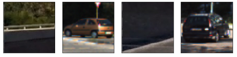
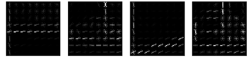
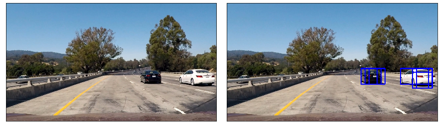
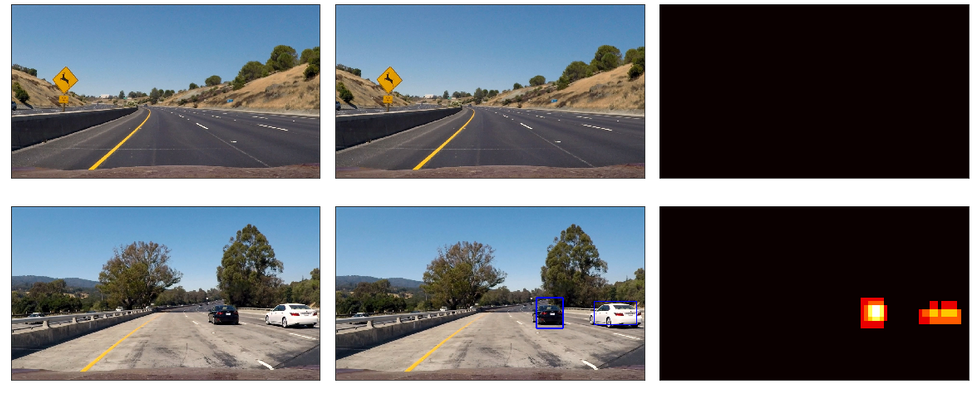

## Vehicle Detection

Below we cover briefly how we addressed each of the rubric points. The Jupyter notebook provides more detailed insight into the pipeline, as well as a larger array of images illustrating our approach. 

## 1. Extracting HOG features and training the Classifier

We used skimage's HOG function to extract the HOG features of our images. We also tried using Open CV, but although it is much faster on an individual basis, since we could not easily adapt it to allow for HOG subsampling (it has no functionality to allow it to return a multidimensional array instead of a vector of features), we chose to implement our extractor following the code of the classes.

We then chose to fit a SVM to our training set. Since the Udacity images are sequential and thus can be very similar, we decided to construct the test set purely from the KITTI images.
After testing the accuracy of the classifier trying different colour spaces, orientations, and cells per block, we settled on the YCrCb colour space, and used 8 pixels per cell, 2 cells per block and 9 orientations. Since we achieved 99.36% accuracy, we decided that our classifier should be good enough for the current task, and proceeded to the other parts of the pipeline.

## 2. Window Searching

Once we had trained the classifier, it was time to find the right way of using it to find cars in the video frames. The first thing we did was to limit the region of the images where we would be interested in seatching for cars. So we cropped roughly the top half of the image and the very bottom, where we see the dashboard. 

We then implemented hog sub sampling with a sliding window search. That is, we choose a region and we draw all the windows determined by our parameters (window size and overlap). We extract the HOG features for the entire region, but keep it as a multidimensional array, thus allowing us to subsample the cells of each window without repeating the extraction. Whenever the classifier identifies a car, we keep that window. Below is an image showcasing the output of this approach.

Notice that there might be multiple windows for any given car. We also found a few false positives in our first implementation, but we were able to severly reduce them by raising the classifier threshold. Instead of using 50% probability as the cutoff between car and no car, we made it 60%. This was enough to see a significant improvement.

We then played around with different sliding window parameters. It should be obvious that the apparent size of a car in the video is strongly correlated with the position in the image, and so cars that appear closer will also look bigger. Using this insight, we ended up with 4 similar regions where we looked for cars ranging in scale from 1 to 2.5, plus two smaller regions to the sides where we looked for cars 3 times larger than our template case.

To make sense of the fact that each car might be identified by more than one window, and also to leverage past information in the video (ie, cars do not appear and dissappear frame on frame), we used a heatmap. Each time a pixel is part of a window that was classified as a car, we increase its cound by 1 (starting from zero of course). We then use a threshold to discard pixels that appear in only few of the windows. This way we are more likely to deal correctly with false positives, and we have a more coherent location for the cars. By doing this not only by frame, but also keeping the information over the last 25 frames, we were able to better capture the cars' position and somewhat smooth the shape of the markers that track them.

## 3. Video

In order to implement our pipeline on the video, we created a class that allowed us to use the information of the previous frames. This class, called Detector, stores the coordinates of all thw windows that have been classified as cars over the last 25 frames, and creates the corresponding heatmap.
The Video can be found in the Output folder of this repository.

## 4. Discussion

Our pipeline works reasonably well in terms of identifying cars on the video, although we would like to improve the smoothness of the rectangles and completely avoid losing either of the cars. The biggest issue though is that the algorithm is way too slow, processing each frame in between 4 and 7 seconds, when we would like it to be processing 24 frames per second or more.

Analyzing the performance, we found out that a big proportion of the processing time is spent rescaling the features. That is, when we do the HOG subsampling, for each window we are unraveling the features and then rescaling, and this rescaling appears to be expensive. Since it should be a linear transformation of the features, it seems strange that we are spending so long on this step. We would like to be able to rescale all the features just as we do the extraction, but the nature of the unraveling does not allow for a simple solution. Even more, the HOG extraction itself is still expensive, even if we are only doing it a few times. This makes us think that perhaps a very different approach (a NN perhaps) is needed. For this sort of application, we care a lot more about the speed of classifying than the speed of training.

Other obvious improvements would be to better use the information we have from previous frames:
* There are only a few places where new cars may appear, so we can reduce our search area.
* If we are tracking a car, we have a good idea of where it might be in the next frame, as well as its apparent size.
* Even if a car obstructs another one, we know it is there, so we should be tracking two and not one.
